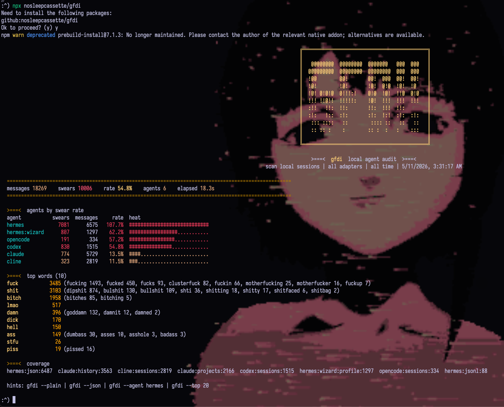

# gfdi



Count profanity across local coding-agent session logs.

GFDI is a fork of `gricha/devrage` with a broader local-session scanner, a compact
terminal dashboard, and Hermes support. Hermes global sessions are reported as
`hermes`, and each Hermes profile history is reported separately as `hermes:<profile>`.

Created by maps. Based on `devrage` by gricha.

Once published to npm:

```sh
npx gfdi
npx gfdi --version
npx gfdi --agent hermes
npx gfdi --json
```

The default command renders a compact terminal dashboard in a real TTY. Use
`--plain` for script-friendly text, `--json` for structured output, or `--tui`
to force the styled dashboard outside a TTY. The default logo is read from
`~/Downloads/gfdi.txt` when present.

```sh
npm install
npm run build
npm link
gfdi scan
gfdi scan --agent hermes
gfdi --top 20 --tui
gfdi --json --agent hermes:wizard
```

## Release

```sh
npm adduser
npm run release:check
npm publish --access public
npx gfdi --version
npx gfdi --plain --top 3
```

If a local npm shim fails with `Cannot find module '../lib/tsc.js'`, refresh
dependencies with `npm install`; GFDI's own scripts call TypeScript directly
through `node_modules/typescript/bin/tsc` to avoid relying on the shim layout.

---

## support this work

maps is currently navigating severe financial precarity and is at real risk of losing her housing. if this project has been useful to you — or you just think what she's building is worth keeping alive — please consider throwing a few dollars her way. it goes directly toward keeping the lights on.

[ko-fi.com/nosleepcassette](https://ko-fi.com/nosleepcassette) · venmo: **@keaghoul** · cashapp: **$keaghoul** · [cassette.help](https://cassette.help)

<!-- cassette.help/donate -->
